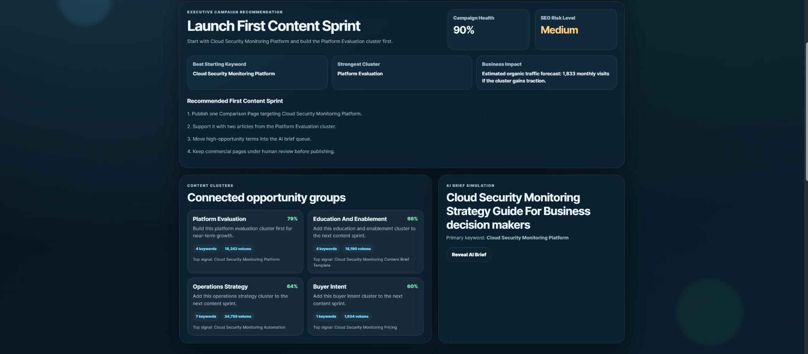

# SearchOps Cloud SEO Intelligence And Content Forecasting Platform

SearchOps is a Cloud + AI-ready SEO intelligence dashboard that turns a seed keyword into structured content opportunities, keyword clusters, opportunity scores, campaign recommendations, traffic forecasts, and simulated AI brief recommendations.

This project upgrades the original SEO Keyword Intelligence Dashboard from a basic keyword utility into a polished SaaS-style content operations platform.

## Product Overview

SearchOps helps teams move from raw keyword ideas into an organized content planning workflow.

The system is designed for marketing teams, SEO consultants, content strategists, SaaS companies, digital agencies, growth teams, and cloud or AI-focused businesses.

## Core Features

- Seed keyword analysis
- Market, audience, and content goal inputs
- Keyword opportunity scoring
- Search intent classification
- Funnel stage mapping
- Keyword clustering
- Campaign Health Score
- SEO Risk Level
- Executive Campaign Recommendation
- Recommended First Content Sprint
- Organic Traffic Forecast
- Recommended content type
- AI Content Production Status
- Simulated AI content brief
- Cloud publishing pipeline view
- Security and cloud readiness panel
- CSV export
- Light and dark mode
- Ripple button interactions
- Animated SaaS dashboard UI

## Cloud + AI Relevance

SearchOps is positioned as a cloud-ready content intelligence platform.

Future production versions could connect to:

- SEO keyword provider APIs
- Google Search Console
- Web analytics platforms
- Cloud databases
- Object storage for exported reports
- Queue-based AI content brief generation
- Human review workflows
- Publishing automation systems
- Cloud monitoring and usage analytics

The project demonstrates how SEO intelligence can connect to Cloud + AI operations without overclaiming live production integrations.

## Security And Data Notes

This portfolio version uses simulated keyword intelligence for demonstration purposes.

The app avoids hardcoded API keys and does not require external credentials. User input is sanitized before analysis and CSV export.

The UI includes a Security + Cloud Readiness panel showing input handling, API secret safety, cloud deployment readiness, and human review workflow design.

Future production hardening should include authentication, API key vaulting, rate limiting, request validation, tenant isolation, cloud logging, secrets management, and secure deployment.

## Tech Stack

- Python
- Flask
- HTML
- CSS
- JavaScript
- CSV export

## Run Locally

PowerShell:

    cd C:\github-audit\SEO-Keyword-Intelligence-Dashboard
    python -m venv .venv
    .\.venv\Scripts\python.exe -m pip install --upgrade pip
    .\.venv\Scripts\python.exe -m pip install -r requirements.txt
    .\.venv\Scripts\python.exe app.py

Then open:

    http://127.0.0.1:5000

## Portfolio Value

This project demonstrates:

- Product thinking
- Cloud + AI positioning
- SaaS dashboard UI
- Search intent logic
- Keyword clustering
- Campaign recommendation logic
- Forecasting logic
- CSV reporting
- Front-end animations
- Light and dark mode
- Security-aware product positioning
- Workflow-oriented software design

## Planned Enhancements

- Real keyword API integration
- Google Search Console integration
- User accounts and workspaces
- Saved campaigns
- AI content brief generation
- Cloud database persistence
- Report history
- Team review approvals
- Publishing workflow automation
- Deployment to a cloud platform

---

## Dashboard Preview

